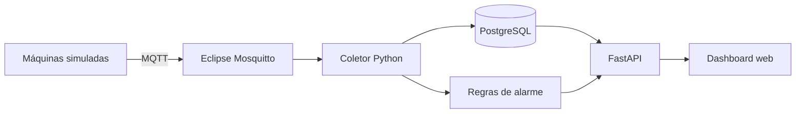

# Monitoramento Industrial com MQTT

Projeto demonstrativo de **Automação Industrial e IIoT** para monitorar máquinas em tempo real. Um simulador publica temperatura, vibração, corrente elétrica e rotação via MQTT; a aplicação Python registra as medições, identifica condições anormais e disponibiliza um dashboard e uma API REST.

> O projeto usa dados simulados e não deve ser empregado como sistema de segurança ou controle de uma planta real.

## Visão geral



## Recursos

- Telemetria de múltiplas máquinas via MQTT;
- variáveis de processo: temperatura, vibração, corrente e RPM;
- armazenamento histórico em PostgreSQL;
- regras configuráveis para alarmes de advertência e estado crítico;
- API REST documentada automaticamente com Swagger;
- dashboard responsivo sem frameworks externos;
- ambiente completo com Docker Compose;
- testes automatizados com Pytest.

## Tecnologias

Python 3.12, FastAPI, SQLAlchemy, PostgreSQL, Eclipse Mosquitto, MQTT, Docker e Pytest.

## Como executar

Pré-requisito: Docker Desktop ou Docker Engine com Compose.

```bash
docker compose up --build
```

Depois, acesse:

- Dashboard: http://localhost:8000
- Documentação Swagger: http://localhost:8000/docs
- Estado da API: http://localhost:8000/api/health

O simulador inicia automaticamente e publica dados de três máquinas a cada dois segundos.

## Principais endpoints

| Método | Rota | Finalidade |
|---|---|---|
| `GET` | `/api/health` | Verifica API, banco e MQTT |
| `GET` | `/api/machines` | Lista máquinas e sua última medição |
| `GET` | `/api/measurements/{machine_id}` | Retorna o histórico da máquina |
| `GET` | `/api/alarms` | Lista ocorrências de alarme recentes |
| `POST` | `/api/measurements` | Permite inserir telemetria sem MQTT |

## Tópico e formato MQTT

Tópico: `factory/machines/{machine_id}/telemetry`

```json
{
  "machine_id": "MOTOR-01",
  "temperature_c": 67.4,
  "vibration_mm_s": 2.8,
  "current_a": 11.2,
  "rpm": 1760,
  "timestamp": "2026-09-20T14:30:00Z"
}
```

## Regras de alarme demonstrativas

| Variável | Advertência | Crítico |
|---|---:|---:|
| Temperatura | 75 °C | 90 °C |
| Vibração | 4,5 mm/s | 7,1 mm/s |
| Corrente | 14 A | 18 A |
| Rotação | abaixo de 1.500 RPM | abaixo de 1.200 RPM |

Os limites são ilustrativos. Em uma aplicação real, devem ser definidos com base no equipamento, processo, normas aplicáveis e análise de risco.

## Testes

```bash
pip install -r requirements.txt
pytest -q
```

## Possíveis evoluções

- integração com ESP32 e sensores reais;
- autenticação e perfis de acesso;
- manutenção preditiva com séries temporais;
- notificações por e-mail ou mensageria;
- integração com Grafana e Prometheus;
- protocolo Modbus TCP para comunicação com CLPs.

## Autor

**Rodrigo Serafim** — Automação Industrial, Python Backend, IoT e Engenharia Elétrica.

- GitHub: [rodrigo-srf](https://github.com/rodrigo-srf)
- LinkedIn: [Rodrigo Serafim](https://www.linkedin.com/in/rodrigo-srf/)
